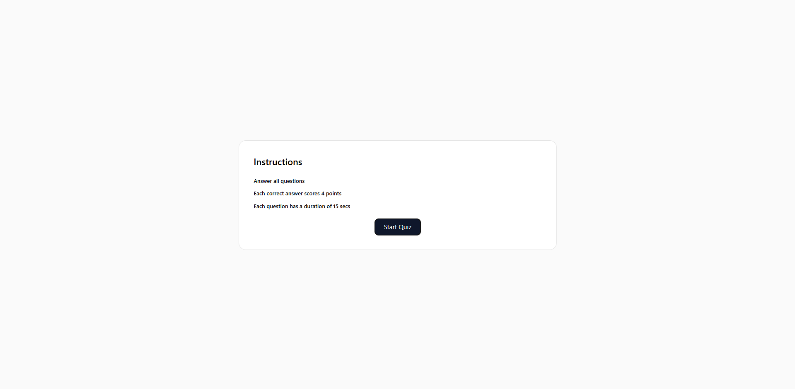
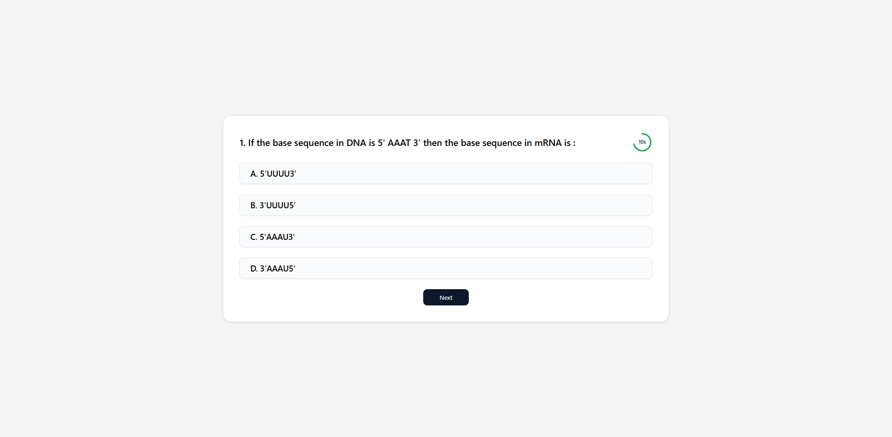
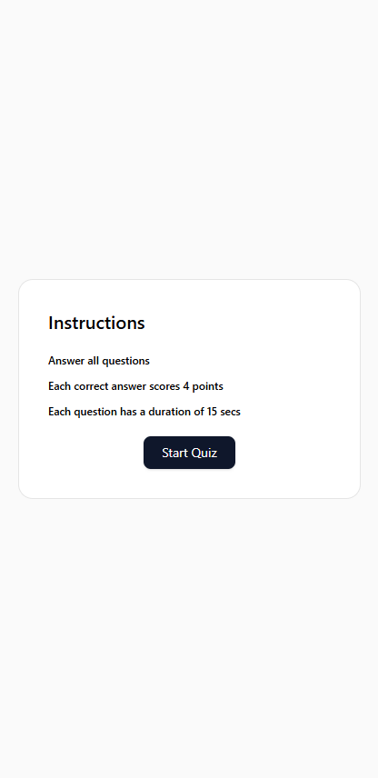
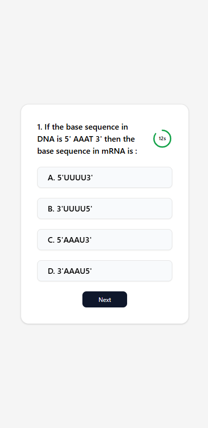
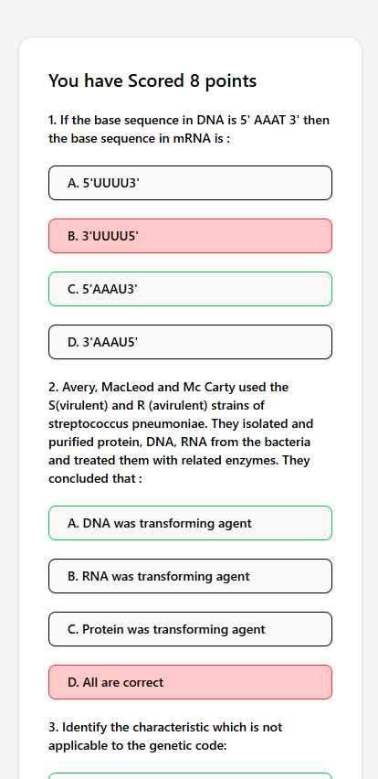

# Testline Assignment

This project is a quiz app

<div style="display: flex; flex-wrap: wrap; gap: 10px;">
  
  
  
</div>
<div style="display: flex; flex-wrap: wrap; gap: 10px;">
  
  
  
</div>

## Demo Video

<video src="./src/assets/demo-video.mp4" width="800" controls></video>


## Installation

To install and run this project, follow these steps:

1. Clone the repository:
  ```sh
  git clone https://github.com/LEELAMANOHARGUDIVADA/testline-assignment.git
  ```
2. Navigate to the project directory:
  ```sh
  cd testline-assignment
  ```
3. Install the dependencies:
  ```sh
  npm install
  ```
4. Start the application:
  ```sh
  npm run dev
  ```

## Components

  ## App.tsx
  This is the main component of the application. It renders the [Quiz](src/components/Quiz.tsx) component.

  ## Quiz.tsx
  This component handles the quiz logic, including fetching questions, handling user answers, and displaying the score.

  ## State Variables:

  | State Variable     | Type    |
  | ------------------ | ------- |
  | `quizStarted`      | boolean |
  | `currentQuestion`  | number  |
  | `optionSelected`   | number  |
  | `questions`        | Array   |
  | `answeredQuestions`| Array   |
  | `timeLeft`         | number  |
  | `score`            | number  |

  ## Functions:

  | Function             | Description                         |
  | -------------------- | ----------------------------------- |
  | `fetchData`          | Fetches quiz questions from the API |
  | `handleNextQuestion` | Handles moving to the next question |
  | `handleSubmitQuiz`   | Handles submitting the quiz         |
  | `handleRestartQuiz`  | Handles restarting the quiz         |

  # Timer.tsx
  This component handles the countdown timer for each question.

  ## Props

  | Props              | Description                                                |
  | ------------------ | ---------------------------------------------------------- |
  | `duration`         | Number representing the total duration of the timer        |
  | `currentQuestion`  | Number representing the current question index             |
  | `timeLeft`         | Number representing the time left for the current question |
  | `setTimeLeft`      | Function to update the time left                           |

  ## Functions:

  | Function             | Description                                              |
  | -------------------- | -------------------------------------------------------- |
  | `getStrokeColor`     | Determines the color of the timer based on the time left |

# Usage

## Start the Quiz:

 Click the "Start Quiz" button to begin the quiz.

## Answer Questions:

Select an option for each question and click "Next" to move to the next question.

## Submit the Quiz:

 Click the "Submit Quiz" button after answering all questions to see your score.

## Restart the Quiz:

 Click the "Restart Quiz" button to retake the quiz.